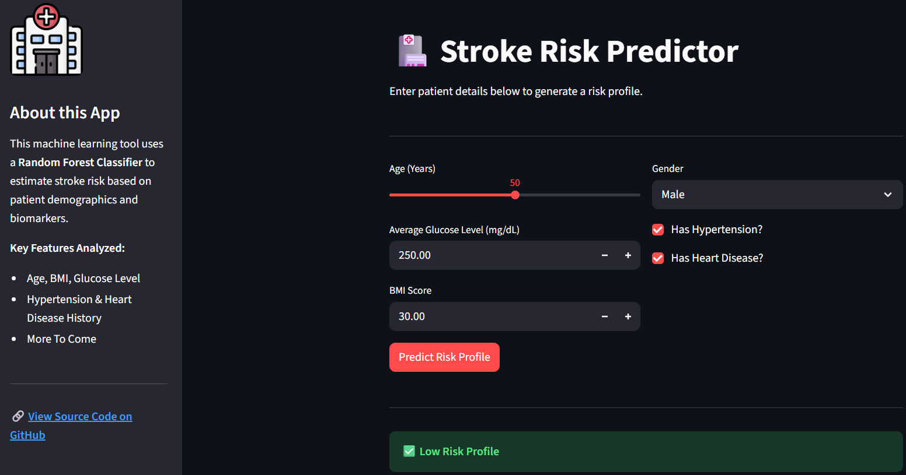

# End-to-End Stroke Risk Prediction App 

A full-stack Machine Learning application that predicts the likelihood of a stroke based on patient inputs (Age, BMI, Glucose, etc.).

### [Click Here to Launch the Live App](https://stroke-prediction-app-fun.streamlit.app/)



### Overview
This project demonstrates the transition from a raw dataset to a deployed machine learning product. It focuses on **interpretable results** for clinical decision support.

**Key Features:**
* **Model:** Random Forest Classifier (Scikit-Learn) optimized for recall.
* **Data Handling:** Imputation of missing values (BMI) and categorical encoding.
* **Interface:** Interactive Streamlit dashboard for real-time risk assessment.
* **Deployment:** Docker Container

### How to Run (Docker)
This app is containerised to avoid dependency conflicts. To run it locally:
1. Clone:
   ```bash
   git clone [https://github.com/Synapsean/stroke-prediction-app.git](https://github.com/Synapsean/stroke-prediction-app.git)
2. Build:
   ```bash
    docker build -t stroke-app .
3. Run:
   ```bash
    docker run -p 8501:8501 stroke-app

*This tool is a prototype for educational purposes and portfolio demonstration. It is not intended for actual medical diagnosis.*
