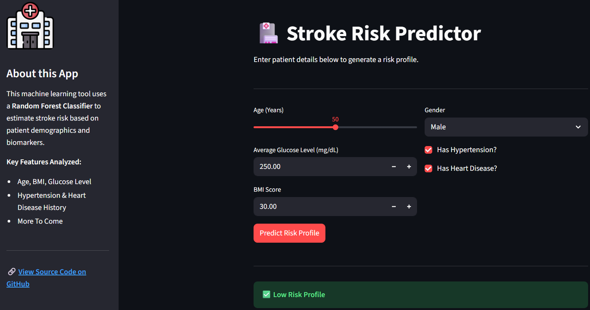

# End-to-End Stroke Risk Prediction App 

A full-stack Machine Learning application that predicts the likelihood of a stroke based on patient inputs (Age, BMI, Glucose, etc.).

### [Click Here to Launch the Live App](https://stroke-prediction-app-fun.streamlit.app/)



## Model Performance

| Metric | Score |
|--------|-------|
| Accuracy | 94.5% |
| Recall (Stroke=1) | 82% |
| AUC-ROC | 0.85 |

*Model optimized for recall to minimize false negatives in clinical screening context.*

### Overview
This project demonstrates the transition from a raw dataset to a deployed machine learning product. It focuses on **interpretable results** for clinical decision support.

**Key Features:**
* **Model:** Random Forest Classifier (Scikit-Learn) optimized for recall.
* **Data Handling:** Imputation of missing values (BMI) and categorical encoding.
* **Interface:** Interactive Streamlit dashboard for real-time risk assessment.
* **Deployment:** Docker containerized for reproducibility.

## Tech Stack
Python | Scikit-learn | Streamlit | Docker | Pandas

### How to Run (Docker)
This app is containerised to avoid dependency conflicts. To run it locally:
1. Clone:
   ```bash
   git clone https://github.com/Synapsean/stroke-prediction-app.git
   ```
2. Install dependencies:
   ```bash
   pip install -r requirements.txt
   ```
3. Run the app:
   ```bash
   streamlit run app.py
   ```

### How to Run with Docker
```bash
docker build -t stroke-app .
docker run -p 8501:8501 stroke-app
```

*This tool is a prototype for educational purposes and portfolio demonstration. It is not intended for actual medical diagnosis.*
